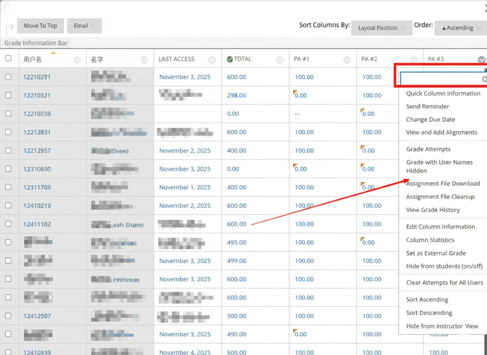

# 配置环境

## 安装 Node.js 以及 pnpm

使用 nvm（按用户安装，适合在同一台机上维护多个 Node 版本）

```shell
curl -o- https://raw.githubusercontent.com/nvm-sh/nvm/v0.39.6/install.sh | bash
source ~/.nvm/nvm.sh
nvm install --lts
node -v
```

安装 pnpm

```shell
npm install -g pnpm
pnpm -v
```

## 安装前端依赖
打开 ta-agent目录，然后
```shell
pnpm i
```

## 安装后端依赖
### 安装 uv（用于运行项目中的 `uv run` 命令）

`uv` 是一个轻量的 Python 工具：

```shell
curl -LsSf https://astral.sh/uv/install.sh | sh
uv --help
```

### 配置python环境
```shell
cd ta_agent_back && uv sync
```

# 如何运行

## 下载
打开BlackBoard
> Grade Center->  Full Grade Center


点击Show All,全选，Submit,下载导出。
## 生成反馈报告（Linux 示例）
### 填写APIKEY
在`ta_agent_back/tools.py`一开始13行
```python
API_KEY = "your_api_key_here"
```
### 文件夹目录
我们设置了如果传入files_path的是“”或者不存在就会找最新的
```python
class MainLoader:
    files_path: Path = Path("")
```
### 修改题目
```python
    XMLPromptList.append(XMLPrompt(
        problem="""
        Part I: Calculating the minimum, maximum, and average of a list of numbers
        In this part of the assignment, you will write a program that finds the minimum, maximum and
        average of a list of numbers, which can be quite useful, for example, after an exam when the
        instructor provides the statistical results of the exam to students. The numbers are integers and
        stored in an array whose size is fixed and defined by a constant called N, in the same way as in
        the example on p. 164 of the text. Your program should prompt the user to input N numbers
        and read them into an array with a for loop. In the second for loop, your program should
        calculate the minimum, maximum and the average of the N numbers and print out the results
        after exiting the second for loop. (You could do everything in one for loop, but for
        simplicity, implement this program with two for loops.) Note that the average of N integers is
        not necessarily an integer, and so you will have to print out the average with the %f format
        specifier. Read p. 147 of the text to learn how to use the casting operation in C to generate a
        float from an integer division. Submit the program as pa6p1.
        """,
        code="",
        original_filename="pa3p1.c"
        ))
```
你需要做的是修改对应的problem和original_filename

在仓库根目录下运行：

```shell
cd ta_agent_back && uv run ./tools.py
```

（如果你在该目录内，也可以直接 `uv run ./tools.py`）

## 启动后端（Linux 示例）

```shell
cd ta_agent_back && uv run -m uvicorn main1:app --reload --host 0.0.0.0 --port 8000
```

## 启动前端（Linux 示例）

```shell
cd ta-agent && pnpm run dev
```

# TODO
